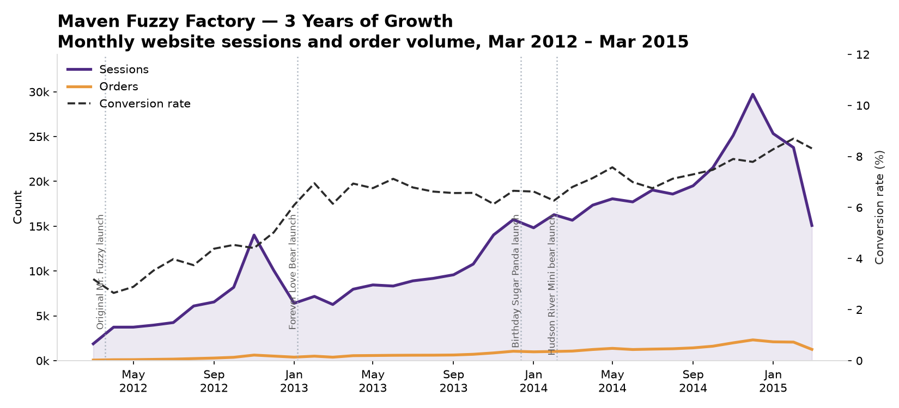
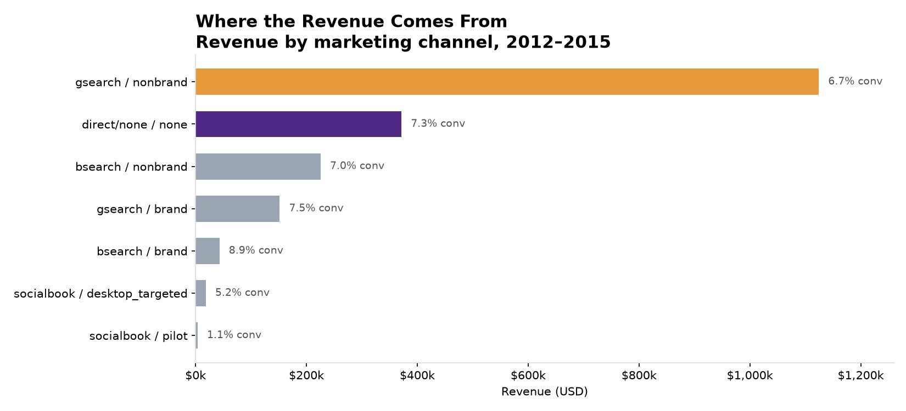
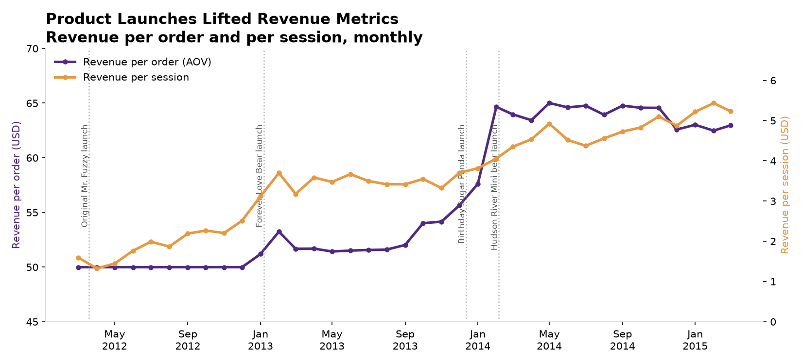
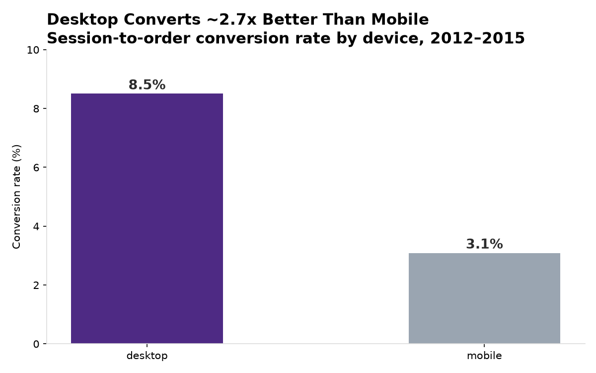

# 🧸 Maven Fuzzy Factory — Marketing & Conversion Analytics

An end-to-end analytics project on the **Maven Fuzzy Factory** dataset (Maven Analytics): an online teddy bear retailer with 3 years of website sessions, pageviews, orders, and refunds (Mar 2012 – Mar 2015).

**Live dashboard:** _(add your Streamlit Community Cloud URL here after deploying — see DEPLOY.md)_

## Business Questions

1. What is the trend in website sessions and order volume?
2. What is the session-to-order conversion rate, and how has it trended?
3. Which marketing channels have been most successful?
4. How has revenue per order evolved? What about revenue per session?

## Tools & Skills

- **SQL** (SQLite) — 9 queries covering trends, conversion funnels, channel performance, cohort-style loyalty tracking, and margin analysis (`fuzzy_factory_analysis.sql`)
- **Python** — pandas for the data pipeline, Streamlit + Plotly for the interactive dashboard
- **Data storytelling** — static charts designed for standalone readability (`charts/`)

## Project Structure

| File | Description |
|------|-------------|
| `load_data.py` | Loads the 6 CSVs into a local SQLite database (`fuzzy_factory.db`) with indexes |
| `build_dashboard_data.py` | Builds the compact session-level data model used by the interactive app |
| `dashboard_data.db` | 70.7 MB deployable model that preserves session-level interactive filters |
| `fuzzy_factory_analysis.sql` | All analysis queries, fully commented |
| `dashboard.py` | Interactive Streamlit dashboard (KPIs, date/channel/device filters, Plotly charts) |
| `make_charts.py` | Regenerates the static PNG charts |
| `charts/` | Portfolio-ready PNGs |
| `linkedin_post.md` | Draft LinkedIn post |
| `DEPLOY.md` | Steps to host the dashboard free on Streamlit Community Cloud |

## Setup

```bash
pip install -r requirements.txt
python3 load_data.py        # builds fuzzy_factory.db from the CSVs (~1 min)
python3 build_dashboard_data.py # builds the deployable interactive data model
python3 make_charts.py      # optional: regenerate PNGs
streamlit run dashboard.py  # opens the dashboard at localhost:8501
```

Dataset: download the free [Maven Fuzzy Factory dataset](https://mavenanalytics.io/data-playground) from Maven Analytics and place the 6 CSVs in this folder. The dashboard uses `dashboard_data.db`, a compact session-level extract that keeps filters interactive without shipping the oversized raw event database.

## Key Findings

**1. Growth was strong and accelerating.** Sessions grew from ~1,900/month (Mar 2012) to a peak of ~29,700 (Dec 2014); monthly orders grew from 60 to 2,314 over the same period — with clear holiday spikes each November–December.



**2. Conversion rate nearly tripled: 3.2% → 8.7%.** Overall session-to-order conversion was 6.83% across the 3 years, but it climbed steadily from 3.19% in the first month to 8.70% (Feb 2015) — a +65% improvement between year 1 (4.62%) and year 3 (7.64%). Growth came from conversion, not just traffic.

**3. Google search non-brand was the revenue engine — but not the most efficient.** gsearch/nonbrand delivered 60% of sessions and $1.12M of $1.94M total revenue (6.7% conversion). However, *direct/none* traffic converted best among large channels (7.3%), and brand campaigns beat non-brand on conversion (7.5–8.9% vs 6.7–7.0%) — a strong case for brand investment. The socialbook pilot was a failure: 1.1% conversion, $0.73 revenue per session vs $3.98+ for search.



**4. Product launches, not pricing, drove the 26% AOV increase.** AOV was frozen at $49.99 for 10 months. After the Forever Love Bear launch (Jan 2013, $59.99), AOV stepped up and kept climbing to ~$63 by 2014 — each launch raised the mix. Revenue per session tripled from $2.34 (year 1) to $4.88 (year 3).



**5. The biggest optimization opportunity: mobile.** Desktop converted at 8.5% vs 3.1% on mobile — a ~2.7x gap that persisted all 3 years across every channel. Meanwhile repeat sessions grew from 9.5% (2012) to 22.1% (2015), showing rising loyalty.



**Bonus finding:** refunds averaged ~5.3% of orders ($85.3k total), with a one-off spike in Sep 2014 ($11.8k).

## Recommendations

1. **Invest in brand search** — highest conversion at scale; defend branded terms.
2. **Fix mobile checkout/UX** — closing even half the desktop/mobile gap would add thousands of orders.
3. **Kill or redesign the socialbook pilot** — it converts 6x worse than search.
4. **Keep the product launch cadence** — each launch measurably lifted AOV and revenue per session.

## Data Notes

- Data is synthetic/anonymized (user IDs only, no PII).
- March 2015 is a partial month (data ends Mar 19, 2015).
- "direct/none" = sessions with NULL utm parameters.
- Refund amounts are attributed to the refund issue date, not the order date.
- The SQL margin query reallocates refunds to the related order month so revenue, COGS, and refunds share one reporting period.

*Dataset credit: [Maven Fuzzy Factory](https://mavenanalytics.io/data-playground) by Maven Analytics. This is an independent portfolio project, not affiliated with Maven Analytics.*
